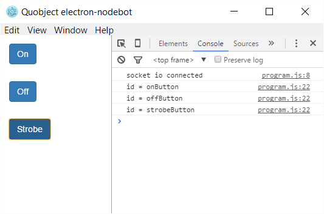

# electron-nodebot


**Example to show how to to control arduino with NodeJS, socket.io, Johnny Five and Electron**

Usually the Arduino Sketch is directly saved into the board and if you want to control it from outside you have to write a protocol yourself to give instruction to the microcontroller.

This code uses the Johnny-five client library http://johnny-five.io/, electron http://electron.atom.io/ as client, NodeJS as server and [socket.io](socket.io) as the connection between client and server.



## Installation
```bash
git clone https://github.com/Quobject/electron-nodebot.git
cd electron-nodebot
npm install
```

## Arduino
Connect pin 13 over 330 Ohm resistor to LED e.g [www.ladyada.net](http://www.ladyada.net/images/arduino/led13bb.jpg)  
Upload `Firmata > StandardFirmataPlus`


## Run server
```bash
cd electron-nodebot
npm run server
```

## Run client
Open another terminal window
```bash
cd electron-nodebot
npm run client
```